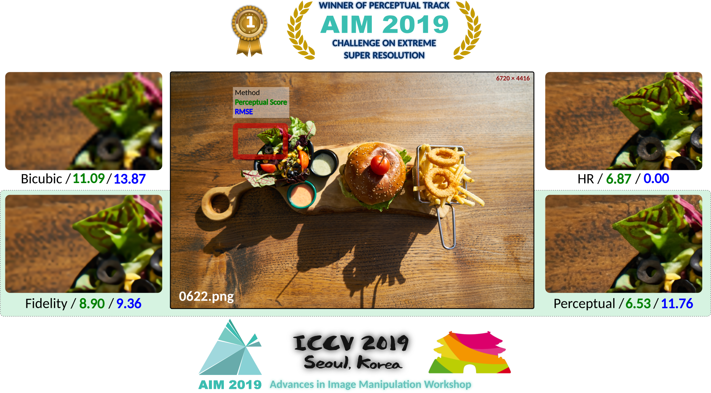

## Multi-Grid Back-Projection version 2.0 (MGBPv2)

    

### Citation

[Pablo Navarrete Michelini, Wenbin Chen, Hanwen Liu and Dan Zhu, "MGBPv2: Scaling Up Multi-Grid Back-Projection Networks", in The IEEE International Conference on Computer Vision Workshops (ICCVW), 2019.](https://www.researchgate.net/publication/327979709_Multi-Scale_Recursive_and_Perception-Distortion_Controllable_Image_Super-Resolution)

#### BibTeX
    @inproceedings{MGBPv2,
        title     = {{MGBP}v2: Scaling Up Multi--Grid Back--Projection Networks},
        author    = {Navarrete~Michelini, Pablo and Chen, Wenbin and Liu, Hanwen and Zhu, Dan},
        booktitle = {The {IEEE} International Conference on Computer Vision Workshops ({ICCVW})},
        month     = {October},
        year      = {2019},
        url       = {https://arxiv.org/abs/1909.12983}
    }

### AIM-2019 Output Images (DIV8K Test Set)
- [16✕ Test Set BOE-Perceptual **(1st place)**](https://www.dropbox.com/s/awmpxqv7myd8s99/BOE_Perceptual.zip) (11GB)
- [16✕ Test Set BOE-Fidelity **(5th place)**](https://www.dropbox.com/s/8iha5eezvuawh85/BOE_Fidelity.zip) (11GB)

### AIM-2019 Model Files
- [BOE-Perceptual **(1st place)**](https://www.dropbox.com/s/f2oe2wywczcen02/BOE_Perceptual_CH3_LE5_MU2_BIAS_NOISE1_FE256-192-128-48-9_Filter#K3_mgbp.model) (112.7MB)
- [BOE-Fidelity **(5th place)**](https://www.dropbox.com/s/ox04zd4bjhamq2w/BOE_Fidelity_CH3_LE5_MU2_BIAS_NOISE1_FE256-192-128-48-9_Filter#K357_merge.model) (1.1GB)

### Instructions:
- Download model files using `./download_models.sh` or links above.

- Copy input images in `input` (provided as empty directory).

- To upscale images 16x run: `python run.py`.

  Output images will come out in `output` (automatically created and cleaned if already exists).

- The GPU number, model file and memory target can be changed in run.py (in comment "CHANGE HERE").

### Requirements:
- Python 3, PyTorch, NumPy, Pillow, OpenCV
